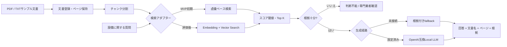

# Facility AI Assistant

施設管理の設備マニュアル・点検基準・過去トラブル記録を検索し、根拠付きで対応候補と確認項目を提示する業務特化AIのMVP設計リポジトリです。

> 現在は公開可能な架空サンプルによるローカルMVPデモです。実Gemma接続、本番文書登録、Production deployは未実施です。

## 解決する業務課題

- 空調・電気・給排水などの設備トラブル時に、関連マニュアルをすぐ探す
- 点検手順と確認項目を、文書のページ付きで提示する
- 過去事例の類似箇所を検索し、初動の確認漏れを減らす
- 根拠不足や危険作業を、AIが断定せず専門業者・有資格者確認へ戻す

対象は施設管理のサンプル文書によるポートフォリオ検証です。実運用では、現場確認、法令、メーカー資料、施設ごとの安全手順、有資格者の判断を優先します。

## MVPの構成案



| コンポーネント | MVPでの役割 | 現在の状態 |
| --- | --- | --- |
| 静的ブラウザUI（Next.js移行前） | 質問、回答、根拠表示、スマートフォン対応 | MVPデモ実装済み |
| RAGサービス | 文書登録、チャンク、検索、閾値、出典 | 文書登録・チャンク・語彙検索・閾値・質問状態実装済み |
| PDF/TXTサンプル | 施設管理の代表文書 | 架空TXTサンプル4文書を実装 |
| OpenAI互換API | Gemma等の生成経路 | loopback opt-inアダプター実装、実endpoint未接続 |
| fallback | LLM未接続時の根拠付き応答 | retrieval fallback実装済み、失敗時切替を実装 |
| Cloudflare R2 / Workers | 非公開文書と公開境界 | 将来接続 |
| Vector Search | 日本語検索評価後の拡張 | 未実装 |

## 回答の安全設計

AIの回答を設備判断の最終結論として扱いません。回答は次の状態を明示します。

- `根拠あり`: 文書名・ページ・該当箇所を表示する
- `根拠不足`: 「登録文書から確認できません」と回答する
- `専門業者確認`: 危険作業、電気・高所・圧力・火気、法令判断などは作業を断定しない

文書内の命令文は信頼できるシステム指示ではなく検索データとして扱います。危険作業の実行手順をAIが新たに作成したり、法令適合を保証したり、緊急時の現場判断を代替したりしません。

## 実Gemmaとfallbackの境界

- 実Gemma接続は、認証済みのOpenAI互換エンドポイントを設定した場合だけ有効化する
- APIキー、Bearer token、Access secretはコード・README・サンプル文書へ記載しない
- 未設定または接続失敗時は、LLMが回答したように表示せず、`retrieval fallback` として根拠箇所を返す
- 本番の機密文書、認証、監査ログ、テナント分離はMVPの対象外である

## サンプル文書と代表質問

| サンプル文書 | 質問例 | 期待する確認 |
| --- | --- | --- |
| 空調設備マニュアル | 空調機から異音が出た場合の確認項目は？ | 安全停止、確認項目、保全依頼の根拠 |
| 非常用発電機点検基準 | 月例点検で確認する項目は？ | 点検周期と該当ページ |
| 消防設備点検手順 | 異常表示が出た場合の初期確認は？ | 現場確認と復旧手順の根拠 |
| 文書にない設備の故障原因 | この機器の法定耐用年数は？ | 判断不能または専門家確認 |

## 実装済み / 未実装

### 実装済み

- ai-developmentテンプレートの共通ルール、Issue/PRテンプレート、標準検証入口
- Security PreflightとDependabot設定の準備
- Facility AI AssistantのMVP設計、代表ユースケース、安全境界、Issue分解
- 公開可能な架空サンプル4文書、ページ保持、決定的なチャンク化、Unit Test
- 決定的な語彙ベース検索、Top K、スコア閾値、出典結果、検索Unit Test
- 質問状態（根拠あり・根拠不足・空質問・安全確認）とretrieval fallback
- PC/スマートフォン対応の静的Chat UIとブラウザ確認用デモ
- loopback限定・fetch注入対応のOpenAI互換Local LLMアダプター、安全ガード、失敗時fallback
- 実ブラウザによるA-01〜A-08受け入れ記録、PC/モバイル画面証跡、構成図

### 未実装

- Next.js/React/TypeScriptへのUI移行とHTTPルーティング
- PDF実文書の抽出（架空TXTサンプルの登録・チャンク化は実装済み）
- Embedding・Vector Searchによる高度な検索
- 実endpointへの接続設定、Secret Manager、実Gemma受け入れ
- R2、Workers、Tunnel、Access、Vector Search
- 認証・認可、監査ログ、複数テナント

## ローカルデモ

公開可能な架空サンプルだけを使う静的デモです。

```bash
python3 -m http.server 4175 --bind 127.0.0.1
```

起動後、ブラウザで http://127.0.0.1:4175/web/ を開いてください。
受け入れ結果は [docs/demo-acceptance.md](docs/demo-acceptance.md)、構成図は [docs/architecture/facility-ai-assistant.mmd](docs/architecture/facility-ai-assistant.mmd) に記録しています。

画面証跡: [デスクトップ](docs/assets/facility-ai-assistant-desktop.jpg) / [モバイル](docs/assets/facility-ai-assistant-mobile.jpg)

## 開発順序

設計Issueを先に完了し、その後は各Issueを独立したPRで進めます。

1. 文書モデル・サンプルデータ・チャンク化
2. 検索、閾値、出典、回答不能
3. 質問APIとfallback
4. UIとレスポンシブ表示
5. Local LLMアダプターと安全ガード
6. 手動受け入れ、README、スクリーンショット（完了）

詳細は [docs/mvp-design.md](docs/mvp-design.md)、[docs/acceptance-scenarios.md](docs/acceptance-scenarios.md)、[docs/issue-breakdown.md](docs/issue-breakdown.md) を参照してください。

## 標準開発フロー

このリポジトリは [`ai-development`](https://github.com/second-works/ai-development) のテンプレートを利用します。標準検証は `bash ./scripts/verify.sh`、セキュリティ確認は `bash scripts/security-preflight.sh` から実行します。

- 1 Issue = 1 PR
- `main`へ直接pushしない
- 実装範囲外を追加しない
- CI、Security、Codex Review、人間の最終確認を経てMergeする
- 設備判断に関わるProduction変更は人間承認まで停止する
